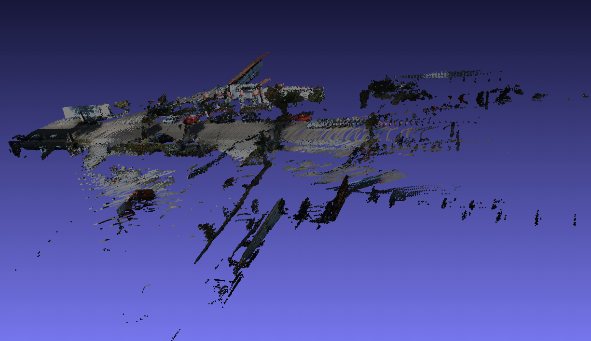

# Lidar to Camera Projection and Point Cloud Visualization

## Objective

This work focuses on visualizing the projection of 3D lidar points onto 2D camera images and generating a point cloud with color information. It utilizes data from the KITTI dataset for this purpose.

## Prerequisites

- **Python:** The script has been developed and tested with Python 3.8.2.
- **Libraries:** The following libraries are required:
  - numpy
  - cv2
  - pykitti
  - PIL
  - matplotlib

## Data Structure

The script expects the KITTI dataset to be available at [http://www.cvlibs.net/datasets/kitti/](http://www.cvlibs.net/datasets/kitti/).

## Expected Output Data

Upon execution, the script generates a 3D point cloud and exports it in a format compatible with meshlabjs for visualization. The projection of lidar points onto the camera image can be visualized using meshlabjs, providing an interactive and immersive viewing experience.

## Note

- This code assumes a specific data structure from the KITTI dataset and may need modifications to work with other datasets or configurations. Additionally, ensure that the necessary dependencies are installed and properly configured.
